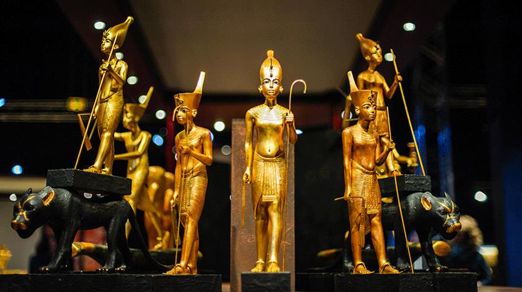

# 🏛️ المتحف المصري الكبير | The Grand Egyptian Museum (GEM)

موقع للمتحف المصري الكبير باستخدام **HTML, CSS, JavaScript**  
يعرض معلومات عن المتحف، أسعار التذاكر، خطط الزيارة، معرض صور تفاعلي، وخريطة الوصول.

## 📸 لمحة سريعة



## 🚀 المميزات

- 🎥 خلفية فيديو في الصفحة الرئيسية (Hero Section)
- 🏛️ قسم تعريفي بالمتحف
- 🖼️ معرض صور تفاعلي (Lightbox + Slider)
- 🎫 أسعار التذاكر والجولات الإرشادية
- 🗓️ مواعيد العمل حسب الأيام
- 🗺️ خريطة الموقع باستخدام Google Maps
- 📱 تصميم متجاوب بالكامل
- 🌙 دعم اللغة العربية RTL

## 📂 الملفات

```
📁 assets/
├── imgs/         => الصور المستخدمة
├── videos/       => فيديو الخلفية
📄 index.html      => الصفحة الرئيسية
📄 style.css       => تنسيقات CSS
📄 script.js       => وظائف تفاعلية JavaScript
```

## 🔧 التقنيات المستخدمة

- HTML5
- CSS3 (Flex, Grid, Media Queries)
- JavaScript (DOM Manipulation, Events)
- Font Awesome Icons
- Google Fonts - Cairo
- Google Maps Embed

## 📦 تشغيل المشروع

1. حمل الملفات أو اعمل Clone:
   ```bash
   git clone https://github.com/basem-samir/the-GEM.git
   cd the-GEM
   ```
2. افتح `index.html` مباشرة في المتصفح  
   أو استخدم Live Server لو عندك VS Code.

## 🌐 المعاينة المباشرة

> [شاهد المشروع على الإنترنت](https://basem-samir.github.io/the-GEM)

## 🙋‍♂️ المطور

- الاسم: **Basem Samir**
- البريد: `basemsamir.dev@gmail.com`

## 📄 الترخيص

هذا المشروع مفتوح المصدر ومتاح تحت رخصة [MIT License](LICENSE).
